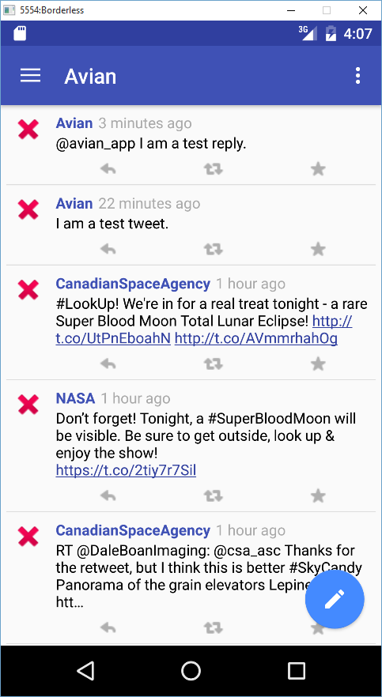

Avian for Twitter
=================

A Twitter client for Android, written in [Kotlin](http://kotlinlang.org). Currently under development.

Done so far
-----------

* Twitter authentication/app authorization
* Loading the user's home timeline
* Composing new tweets and replying to others

Screenshots
-----------

